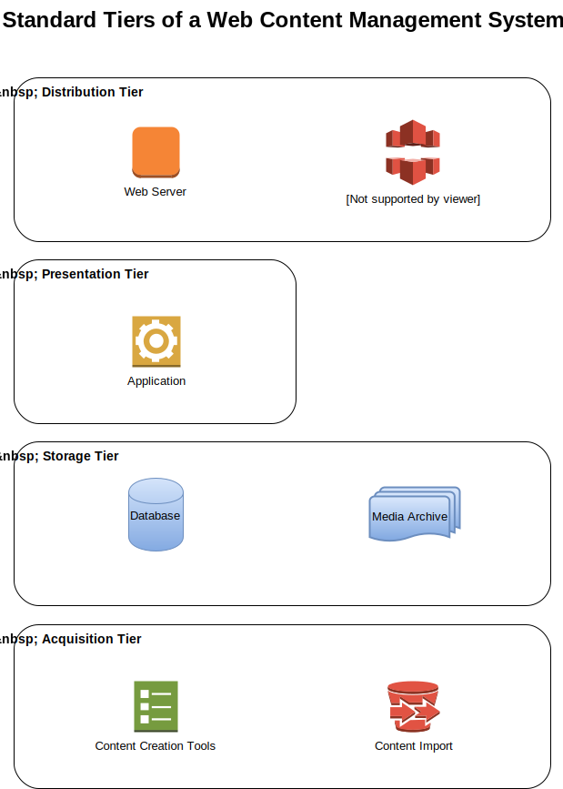

---
itemtype: Item/Page/Article
guid: urn:UUID:0a3495f0-eaa4-4866-ba81-4e8856cb904d
created: 2016-11-24T09:09:11.051435-05:00
updated: 2016-11-24T09:09:11.051435-05:00
published: 2016-11-24T09:09:11.051435-05:00
thumbnail: 
    href: /content-management/CMS-tiers.svg
description: "Describes the four basic tiers of any CMS, and their functions: distribution, presentation, storage, and acquisition."
title: "What is a Content Management System?"
...

# What is a Content Management System?

Yes, the obvious, simplest answer is, it’s a system for managing content. We’re
going to dig a little deeper here to talk about the common elements found in
most content management systems, so that later, we can compare and contrast
different systems based on how they implement those elements.

I’ll be covering "web content management" (WCM) here, and not necessarily
"enterprise content management" (ECM), because I am interested in digital media
publishing and marketing, not corporate data management policies (although much
of this would apply to ECM as well).

The majority of web content management systems can be divided into four
sub-systems, which taken together constitute a stack, with content flowing up
from bottom to top.

## TL;DR: The four tiers of a CMS

A web content management system typically is delivered as vertically integrated
package with four tiers:

* Content distribution (the web server and/or CDN)
* Content presentation tools (the application, themes, and templates)
* Content storage, retrieval, and search (the database, media archive, and
  search index)
* Content acquisition (the "admin")

## Content Distribution (the Web Server, CDN)

At the top of the stack is the content distribution system. This typically
consists of some web servers ([Apache][] or [Nginx][], for example), usually
fronted by a content delivery network (such as [Cloudflare][], [CloudFront][],
[Cachefly][], etc.) and/or a farm of reverse proxy servers (Varnish or Squid),
plus a load balancer (for high availability, a matched pair of load balancers)
to spread the traffic and ensure the system continues to operate in the event
that one or more servers have problems.

Although there is a separate tier for storage of canonical assets, very often
the distribution tier has its own storage, usually called a cache. Sometimes,
however, the distribution tier will server assets directly from canonical
storage (for example, if you have an S3 bucket or file system directory that
stores image files).

[Apache]: https://httpd.apache.org/docs/
[Nginx]: https://nginx.org/en/
[Cloudflare]: https://www.cloudflare.com/
[Cloudfront]: https://aws.amazon.com/cloudfront/
[Cachefly]: https://www.cachefly.com/

## Content Presentation (the Application Server, theme, templates)

The presentation tier is primarily concerned with transforming content assets
from their canonical form into a form suitable for distribution. Often this
means retrieving the content from a database and rendering it using a template
to produce HTML to be viewed in a web browser. It might also mean minifying
and/or compressing static assets like stylesheets and JavaScript, or
resizing/compressing images to optimize delivery size.

## Storage, Retrieval, and Search (the Database, search engine)

Although the function of storage and retrieval can be, and often is, handled by
a separate system from the search function, these two functions are almost
always tightly coupled, and are sometimes implemented in the same underlying
tool (a relational database). As a result, they are grouped together in the same
tier.

A typical content managements system’s storage tier will begin with a relational
database such as [MySQL][] or [PostgreSQL][]. The database usually indexes
metadata, and stores textual content. It is usually coupled with a file system
or object storage system (e.g. S3) to store non-text assets such as images and
video.  Sometimes, there is a secondary index using an engine optimized for
full-text search, such as [Solr][] or [ElasticSearch][], set up adjacent to the
main database.

[MySQL]: https://www.mysql.com/
[PostgreSQL]: https://www.postgresql.org/
[Solr]: https://lucene.apache.org/solr/
[ElasticSearch]: https://www.elastic.co/products/elasticsearch

## Content Acquisition (the Admin)

At the bottom of the stack, practically every CMS provides some kind of
interface for uploading content assets or entering text assets. Most provide a
web interface for this. A few provide native applications for one or more
platforms (desktop or mobile).

This tier is called "acquisition", not "production", because, other than
blogging tools like [WordPress][], in practice it is uncommon for the CMS
interface to be the primary tool for composing content. Certainly photos,
videos, and audio files are almost always produced by some specialty tool
external to the CMS, and their output is then uploaded to the CMS as a binary
asset. Even text articles are frequently composed in some external tool, such as
[Evernote][] or MS Word, and pasted into the CMS after editing.

For larger content management systems, such as those used at professional media
organizations, the content acquisition tier also literally acquires content, by
importing it from third party syndication feeds, on an automated schedule.

[WordPress]: https://wordpress.org/
[Evernote]: https://evernote.com/

## A composable CMS stack?

Interestingly, although these are usually delivered as an integrated package, it
is certainly possible to decompose these four tiers and deliver them separately. 

The distribution tier, for example, often is not included in packaged software
content management systems (bring your own distribution). [Contentful][]
completely excludes the presentation tier, providing acquisition and storage of
structured data, and a web API for retrieving it. [Headless Drupal][] is another
approach that delivers the presentation tier separately.

In theory, all four tiers could be decoupled with clean interfaces, allowing
integrators to mix and match components to construct custom stacks. In practice,
this is not currently feasible, since no standards exist for how the interfaces
between tiers should be constructed.

[Headless Drupal]: http://blog.openlucius.com/en/blog/headless-drupal-why-how-restful-api-drupal
[Contentful]: https://www.contentful.com/

